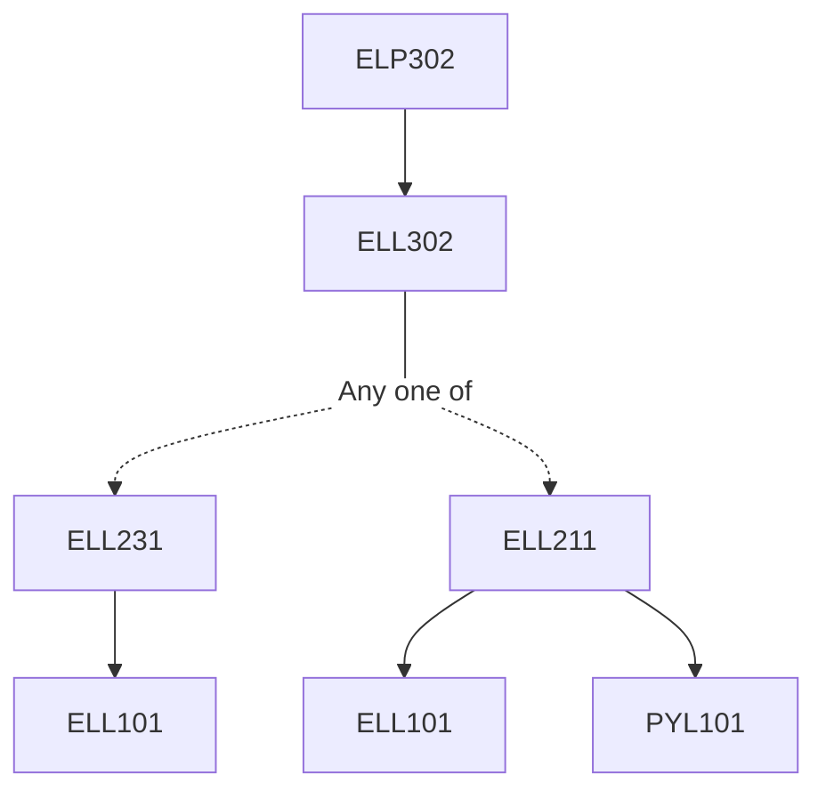

**Credits:** 1.5 (0-0-3)

**Prerequisites:** [[/Electrical Engineering/ELL302 | ELL302]]

#### Description 
No description available

### Prerequisite Tree

```mermaid
flowchart TD
ELP302-156[ELP302]
ELP302-156 --> ELL302-156[ELL302]
ELL302-156 --- Or157[Any one of]:::empty
ELL231-158 --> ELL101-158[ELL101]
Or157 -.-> ELL231-158[ELL231]
ELL211-159 --> ELL101-159[ELL101]
Or157 -.-> ELL211-159[ELL211]
ELL211-159 --> PYL101-159[PYL101]

classDef empty height:17px, fill:transparent, stroke:transparent;
classDef trueEmpty height:0px, width:0px;
```