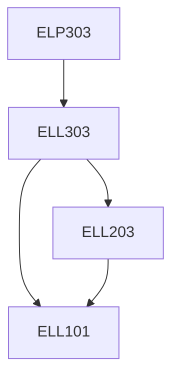

**Credits:** 1.5 (0-0-3)

**Prerequisites:** [[/Electrical Engineering/ELP303 | ELP303]]

#### Description 
Experiments will be conducted on 3-phase alternators and transformers for measuring their sequence impedance. Directional, overcurrent and differential protection relays will be studied. Computer simulation for power flow, short circuit and stability studies of interconnected power systems. Numerical relays and synchrophasors will be introduced. FACTS devices will be experimented.

### Prerequisite Tree

