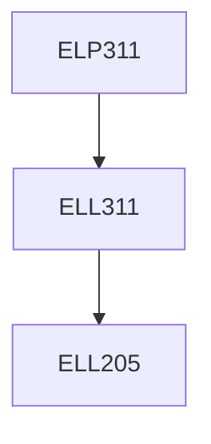

**Credits:** 1 (0-0-2)

**Prerequisites:** [[/Electrical Engineering/ELL311 | ELL311]]

#### Description 
Laboratory experiments on analog, pulse, and basic digital modulation and demodulation techniques.

### Prerequisite Tree

