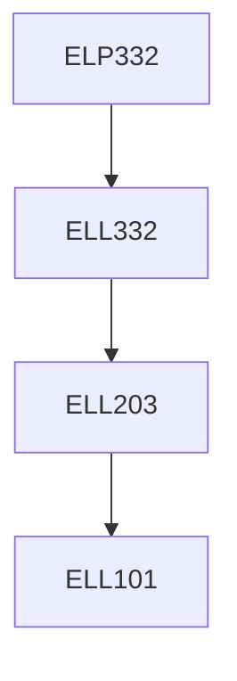

**Credits:** 1.5 (0-0-3)

**Prerequisites:** [[/Electrical Engineering/ELL332|ELL332]]

#### Description
No description available.

### Prerequisite Tree

```mermaid
flowchart TD
ELP332-386[ELP332]
ELL332-386 --> ELL203-386[ELL203]
ELP332-386 --> ELL332-386[ELL332]
ELL203-386 --> ELL101-386[ELL101]

classDef empty height:17px, fill:transparent, stroke:transparent;
classDef trueEmpty height:0px, width:0px;
```