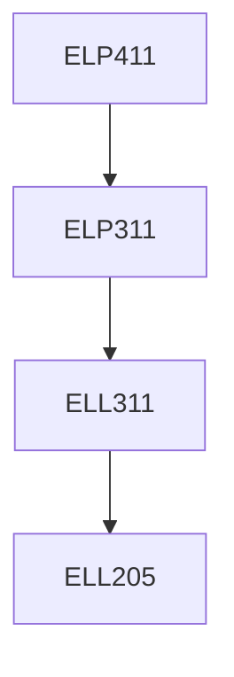

**Credits:** 1 (0-0-2)

**Prerequisites:** [[/Electrical Engineering/ELP311|ELP311]]

#### Description
No description available.

### Prerequisite Tree

```mermaid
flowchart TD
ELP411-387[ELP411]
ELP311-387 --> ELL311-387[ELL311]
ELL311-387 --> ELL205-387[ELL205]
ELP411-387 --> ELP311-387[ELP311]

classDef empty height:17px, fill:transparent, stroke:transparent;
classDef trueEmpty height:0px, width:0px;
```