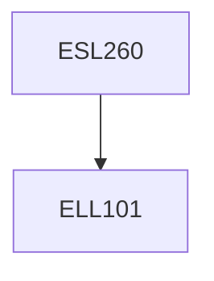

**Credits:** 3 (2-1-0)

**Prerequisites:** [[/Electrical Engineering/ELL101|ELL101]]

**Overlaps with:** Some overlap with ELL202

#### Description
Circuits, types, properties and models. Circuit modeling methods.

Steady state / transition processes and equivalent models of circuit elements. Types of circuit responses. Time-domain response: calculating step and impulse responses of circuits containing resistors, inductors and capacitors. Time-domain analysis of first (RC and RL) and second order (RLC) circuits. Resonance in RLC circuits. Inductive (magnetic) coupling. Mutual inductance. Series and parallel resonant RLC circuits. Two magnetically coupled RLC circuits. Computation of circuit response to arbitrary input signals – convolution. Convolution properties. The forward and inverse Laplace transforms. S-domain circuit analysis. Study subject structure Two-port networks: impedance and admittance matrices, two-port network connections, reciprocity and symmetry.

### Prerequisite Tree

