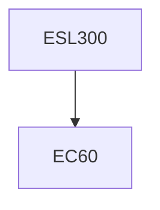

**Credits:** 3 (3-0-0)

**Prerequisites:** EC60 (for UG students)

#### Description
Dynamical systems dissipative and area preserving, Patterns in Hamiltonian dynamics invariants and symmetry, KAM theorem / coherent structures, complexity and pattern formation, Belousov – Zhabutinsky reaction, Landau-Ginzburg / mean-field models, scaling fractals, Cellular automata, Wavelet transforms, Phase transitions and order parameter, Criticality the border of order and chaos, Entropy and direction of time, Negentropic systems, Self-organized criticality, lattice models, Examples: Electrical circuits, Management systems, Astrophysical systems, Plasma and magnetic surface systems, Biological systems, Non-linear systems.

### Prerequisite Tree

