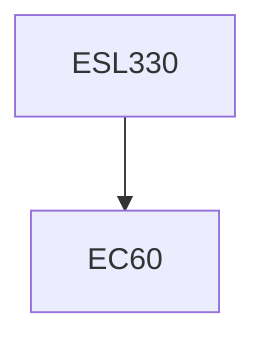

**Credits:** 4 (3-1-0)

**Prerequisites:** EC60 (for UG students)

**Overlaps with:** Some overlap with ESL710

#### Description
Concepts of ecosystems and environment, Characteristics and types of ecosystems, Autecology and synecology, Energy flow in ecosystems, Feedback loops, Trophic webs, Eco-technology and Eco-development, Energy-environment interaction, Impact of energy sources (coal, oil, natural gas, solar, wind, biomass, hydro, geothermal, tidal, wave, ocean thermal and nuclear) on environment, local regional and global implications, Approaches to mitigate environmental emissions from energy sector, Global initiatives Kyoto Protocol, Clean development mechanism, Case studies.

### Prerequisite Tree

