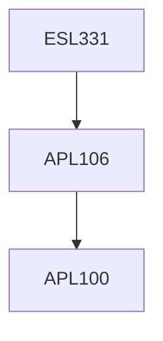

**Credits:** 4 (3-1-0)

**Prerequisites:** [[/Applied Mechanics/APL106|APL106]]

**Overlaps with:** Some overlap with ESL768, CVL482

#### Description
Basic fluid mechanics of turbo-machinery, momentum and the head-

momentum equations, Classification of Hydrodynamic machines, Theory of turbo machinery, Euler's theorem, Velocity and pressure diagram, Head, Power, Efficiency Dimensional analysis and similarity, Specific-speed, Hill curves; Pelton Turbine: working principle, velocity triangles, nozzle and flow regulating mechanism, jet deflector, braking, power and efficiency; Francis and Kaplan Turbines, working principles, degree of reaction, velocity triangles, power and efficiency, regulation; draft tube; Performance characteristics of turbines; Hydro-kinematic turbines, Pump as turbine; Centrifugal and axial flow pumps, head-flow rate, specific speed, power, efficiency, operating point for different pump systems, cavitation in pumps and turbines; Hydrodynamic transmissions.

### Prerequisite Tree

