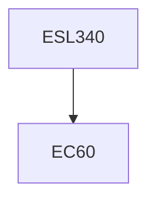

**Credits:** 4 (3-0-2)

**Prerequisites:** EC60 (for UG students)

**Overlaps with:** Some overlap with ESL740

#### Description
Global & National energy scenarios, Forms & characteristics of renewable energy sources, Solar radiation, Flat plate collectors, Solar concentrators, Thermal Applications of solar energy, Photovoltaics technology and applications, Energy storage, Energy from biomass, Thermochemical, Biochemical conversion to fuels, biogas and its applications, Wind characteristics, Resource assessment, Horizontal & vertical axis wind turbines, Electricity generation and water pumping, Micro/Mini hydropower systems, Water pumping and conversion to electricity, Hydraulic ram pump, Ocean Thermal Energy Conversion (OTEC), Geothermal, Tidal and Wave energies, Material aspects of Renewable energy technologies and systems.

### Prerequisite Tree

