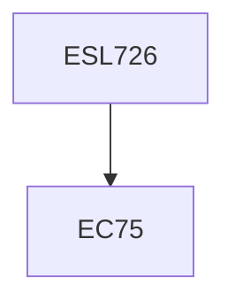

**Credits:** 3 (3-0-0)

**Prerequisites:** EC 75 (for UG Students in Minor Area)

#### Description
Introduction to Waste heat recovery, Classifications, Principles, Utilizations, Strategy of using waste heat recovery, Basic Heat Exchanger Design Concepts, Heat Exchanger equipment classifications, Steam generation equipment, Power plant heat recovery systems, Commercial waste heat recovery systems with detailed study of Recuperators, Radiation/Convective Hybrid Recuperator, Ceramic Regenerator, Introduction to efficient building design.

### Prerequisite Tree

