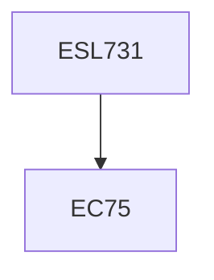

**Credits:** 3 (3-0-0)

**Prerequisites:** EC 75 (for UG Students in Minor Area)

#### Description
Biogas-animal dung and agroresidues and other cellulose wastes, ethanol from wheat or corn, sugar cane, sweetsorghum, beet roots, grapes, starch etc. pyrolysis of biomass. Direct combustion of biomass, Improved stoves routes.

Second Generation Biofuels:- Biodiesel from oil seeds, Gasification of agroresidues, sawdust etc, Micro-power generation through biomass gasifiers, waste incineration fluidized bed combustion of biomass. Third Generation Biofuels:- Algae based Biodiesel, Ethanol, Hydrogen, alcohols from agroresidues, chemical composition of lignocellulosic biomass fuels and chemicals from each component biomass (Hemicellulose, Cellulose, and Lignin), Chemical, Thermochemical and Biochemical processes, Availability of biomass, petrocrops, aquatic biomass and its potential, concept of bioeconomy and biorefineries.

### Prerequisite Tree

