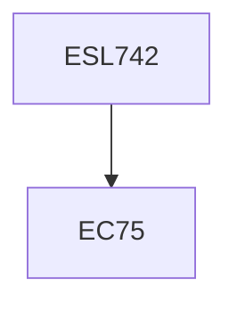

**Credits:** 3 (3-0-0)

**Prerequisites:** EC 75 (for UG students in Minor Area)

#### Description
Overview of renewable energy technologies. Relevance of economic and financial viability evaluation of renewable energy technologies, Basics of engineering economics, Financial feasibility evaluation of renewable energy technologies, Social cost – benefit analysis of renewable energy technologies. Technology dissemination models, Volume and learning effects on costs of renewable energy systems, Dynamics of fuel substitution by renewable energy systems and quantification of benefits. Fiscal, financial and other incentives for promotion of renewable energy systems and their effect on financial and economic viability. Financing of renewable energy systems, Carbon finance potential of renewable energy technologies and impact of other incentives. Software for financial evaluation of renewable energy systems. Case studies on financial and economic feasibility evaluation of renewable energy projects.

### Prerequisite Tree

