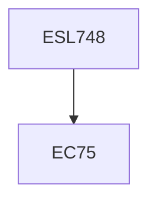

**Credits:** 3 (3-0-0)

**Prerequisites:** EC 75 (for UG Students in Minor Area)

#### Description
Overview of measures and approaches towards improved energy efficiency and energy conservation in various sectors of the economy; Need for studying economics of energy conservation; Identification and quantification of costs and benefits associated with energy conservation projects; Time value of money, discount rate and basic formulae of engineering economics; Measures of financial/economic performance for appraisal/evaluation of energy conservation projects; Approaches for considering uncertainty in appraisal/evaluation;

Existing and potential incentives for promoting energy conservation measures, regulations and policy measures; Carbon mitigation benefits; Development of techno-economic models; Software for economic assessment of energy conservation projects; Financing of energy conservation projects; Case studies.

### Prerequisite Tree

