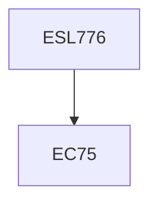

**Credits:** 3 (3-0-0)

**Prerequisites:** EC 75 (for UG Students in Minor Area)

#### Description
Industrial energy use and its disaggregation (in terms of production dependent, weather dependent and independent etc. components), Energy intensity, Pinch analysis, Lean energy analysis, Thermodynamics and energy analysis, Life cycle energy analysis, Energy analysis and energy management, Energy audits, Managing energy efficiency in the industry. Basic approaches and tools for environment analysis, life cycle analysis and environmental impact assessment of industrial products and processes, Inventory of materials and energy inputs and environmental emissions, Emission factors, Relevant ISO standards (such as ISO 14040 and ISO 14044), Potential of energy and materials recovery, Case studies.

### Prerequisite Tree

