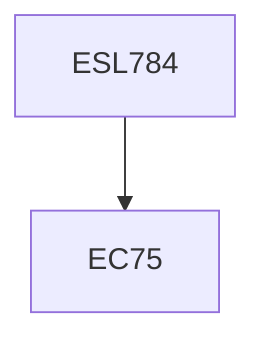

**Credits:** 3 (3-0-0)

**Prerequisites:** EC 75 (for UG Students in Minor Area)

#### Description
The cogeneration concept, Main design parameters for cogeneration, Cogeneration alternatives, cogeneration efficiency, Steam turbine plants, Gas turbine plants, Spark ignition engine and compression ignition engine power plant, Combined cycle power plant, Sterling engine, Industry/Utility cogeneration, Tri-generation, poly-generation, Cogeneration in sugar, textile, paper and steel industry, Case studies.

### Prerequisite Tree

