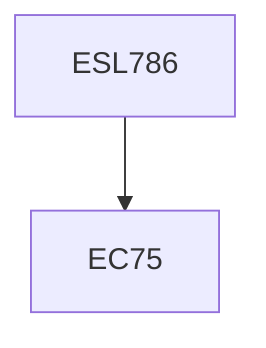

**Credits:** 3 (3-0-0)

**Prerequisites:** EC 75 (for UG Students in Minor Area)

#### Description
Thermodynamic basis of available energy, exergy and entropy, Exergy balance equations for closed and open flow systems under steady state and unsteady state conditions, Exergetic efficiency definition for various devices, components including heat exchangers, mixing chamber and drying process, Exergy analysis of thermal energy systems including thermal power plants, refrigeration and heat pump / air-conditioning plants, Exergy analysis of solar energy systems, solar cooker / dryer / collector / concentrator / solar still / solar pond / thermal storage systems and solar thermal power generation, solar photo voltaic system, Economics based on exergy analysis of thermal energy systems.

### Prerequisite Tree

