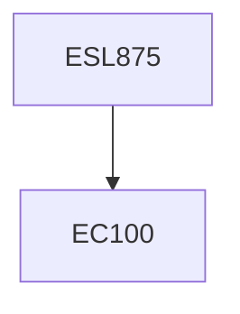

**Credits:** 3 (3-0-0)

**Prerequisites:** EC 100 (for UG Students in Minor Area)

#### Description
An introduction to hydrocarbon fuels-their availability and effect on environment, Resources such as shale gas and petroleum, Gasoline and Diesel self-ignition characteristics of the fuel, octane number, Cetane number, Alternative fuels -liquid and gaseous fuels, Physico-chemical characteristics, Alternative liquid fuels, Alcohol fuels -ethanol and methanol, fuel composition, Fuel induction techniques, Fumigation, Emission of oxygenates, Applications to engines and automotive conversions, Biodiesel formulation techniques, Transesterification, Application in diesel engines, Dimethyl ether(DME), properties fuel injection consideration general introduction to Liquefied Petroleum Gas (LPG) and Liquefied Natural Gas (LNG), Compressed natural gas (CNG) components, mixtures and kits, Fuel supply system and emission studies and control, Hydrogen combustion characteristics, Flashback control techniques, Safety aspects and system development, NOx emission control, Biogas, Producer gas and their characteristics, System development for engine application.

### Prerequisite Tree

