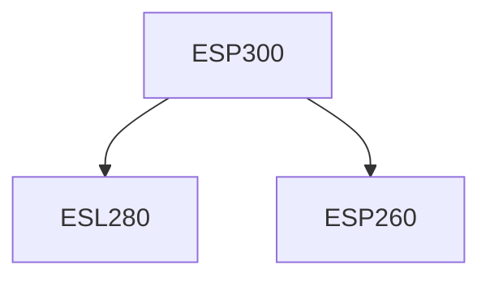

**Credits:** 1.5 (0-0-3)

**Prerequisites:** [[/Energy Science and Engineering/ESP260|ESP260]], [[/Energy Science and Engineering/ESL280|ESL280]]

#### Description
Students will be doing innovative projects relevant to energy engineering based on their interest. Based on the Student interest, they will be assigned to perform energy related design projects/ experiments.

### Prerequisite Tree

