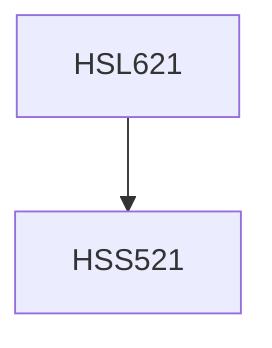

**Credits:** 3 (2-1-0)

**Prerequisites:** [[/Humanities and Social Sciences/HSS521|HSS521]]

#### Description
Broad areas to be covered will include linear algebra (vector spaces, matrices), real analysis and calculus (derivatives, integration, ordinary differential equations), and elementary probability theory.

Note: While there is an overlap between the current course and MTL 100, the orientation of the current course will be based on Cognitive Science topics and themes.

### Prerequisite Tree

