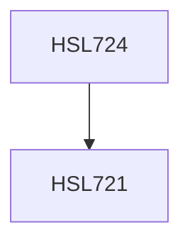

**Credits:** 1.5 (0.5-0-2)

**Prerequisites:** [[/Humanities and Social Sciences/HSL721|HSL721]]

#### Description
We will first summarize the basics of experimentation. Following this, we will focus on a particular experimental paradigm (e.g., Eye-

tracking, EEG) where the key concepts related to the paradigm will be discussed. Some research papers that have used this paradigm in domains such as attention, language processing, etc. will be discussed. Advantages and challenges to the paradigm will be discussed. In addition, practical sessions will be conducted to get a hands-on experience on a particular paradigm.

### Prerequisite Tree

