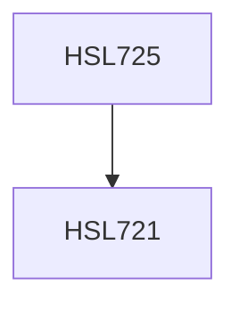

**Credits:** 1.5 (0.5-0-2)

**Prerequisites:** [[/Humanities and Social Sciences/HSL721|HSL721]]

#### Description
We will start by discussing the qualitative research paradigm, noting the ontological and epistemological assumptions and values of reflexivity and subjectivity. We then learn about planning and designing qualitative research and consider the sampling requirements and ethical concerns. Various data collection techniques will be introduced, such as interviews, focus group, textual data: surveys, diaries, secondary sources. Finally, we will learn to analyze the qualitative data, focusing on three different approaches - thematic analysis, discourse analysis, and interpretative phenomenological analysis. Teamwork and interactive exercises will be emphasized. Students will gain hands-on experience in various qualitative methods and analysis techniques. Students will also be introduced to NVivo – a widely used qualitative analysis software.

### Prerequisite Tree

