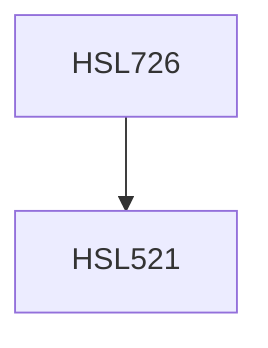

**Credits:** 3 (3-0-0)

**Prerequisites:** [[/Humanities and Social Sciences/HSL521|HSL521]]

#### Description
Introduction: culture and cognition; the cultural foundations of cognition: basic cognitive processes- perceiving, attending, framing, classifying, generalizing, symbolizing and memory; research methodology relevant to the field; cultural studies & comparative designs; belief systems, ideology and culture: examining folk beliefs, social axioms and scientific concepts (their use and abuse), identity construction- individual and collective and micro-level cultural practices and social transformation; toward a cognitive theory of culture: the sharing of culture & the exploration of cultural differences, public & private culture: the emergence of shared meaning, cultural diversity & cognition, acculturation, polycultural psychology; cultural competence, combining strength: toward a new science of culture, schemata, cultural models, & consensus; problems and issues, the idea of geography of thought, subjective culture, cross- cultural explorations and issues of authenticity and measurement of cultural concepts; perspectives on indigenous psychology, diversity in Indian culture & cognition; latest research in the field & future directions.

### Prerequisite Tree

