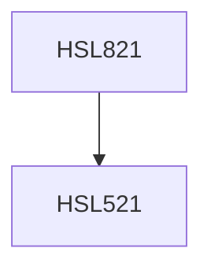

**Credits:** 3 (2-0-2)

**Prerequisites:** [[/Humanities and Social Sciences/HSL521|HSL521]]

#### Description
The course will begin with introducing the basics and origins of eye-movement of the human eye. We will then see how analyzing eye movement patterns can provide an insight into various cognitive processes such as vision, attention, reading, language processing, etc. The course will also provide hands-on sessions for handling an eye tracker.

### Prerequisite Tree

