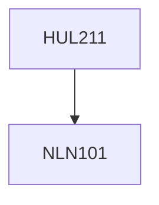

**Credits:** 4 (3-1-0)

**Prerequisites:** [[/NLN101|NLN101]]

#### Description
Current economic problems. Alternative economic systems. An overview of the economy. The market mechanism. National product and income. Consumption, savings and investment. Determination of national income. Aggregate demand and supply. Fiscal policy. The nature of money and monetary policy. Inflation and unemployment. Basic concepts of price theory. Determination of price by supply and demand. Elasticity of demand and supply. Theory of production. Theory of costs. Pricing in competitive and monopoly markets. The gains from international trade. Theory of exchange rates. Balance of payments. Economic growth, and development. Inequality and poverty.

### Prerequisite Tree

