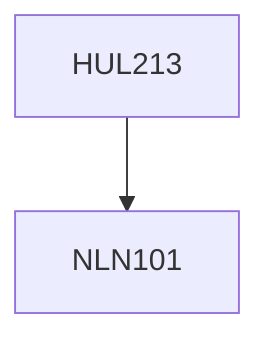

**Credits:** 4 (3-1-0)

**Prerequisites:** [[/NLN101|NLN101]]

#### Description
Major economic problems. National income accounting. Expenditure and income approaches to GNP. Measuring inflation and unemployment. Determination of the equilibrium level of income. Consumption function. Investment demand. Aggregate demand and equilibrium output. The multiplier process. Government sector. Fiscal policy. Tax receipts and Transfer payments. Foreign spending. Money, interest and income. Functions of money. Definition of money. Reserve Bank of India and Commercial Banks. Creation of money. The instruments of monetary control. The demand for money. Investment expenditure and rate of interest. The IS curve. Money market and the LM curve. Liquidity trap. The IS-LM model. Derivation of the aggregate demand curve. Monetary and fiscal polices. Keynesian versus monetarist views. The aggregate supply function: Keynesian and classical. Inflation and unemployment. Stagflation. The Phillips curve. The long-run Phillips curve. Inflation expectations. The rational expectations.

### Prerequisite Tree

