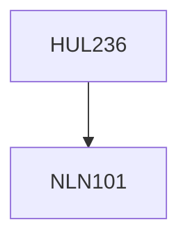

**Credits:** 4 (3-1-0)

**Prerequisites:** [[/NLN101|NLN101]]

#### Description
Brief history of the development and importance of drama in Western and Indian contexts. Readings from both ancient and contemporary drama theorists. Generic differences between different forms of drama such as tragedy, comedy, realist, ‘folk’, Absurd, etc. Detailed study of important examples of different forms of drama.

### Prerequisite Tree

