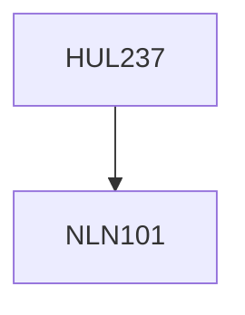

**Credits:** 4 (3-1-0)

**Prerequisites:** [[/NLN101|NLN101]]

#### Description

- Approaches to contemporary fiction - Looking at contemporary styles - realism, modernism, postmodernism - Contemporary versions of classical genres - the diary, epistolary form, epic, etc. - the relationship of society with science and technology through fiction
- the relationship between self and society through fiction -Race, nationality, culture and identity - contemporary forms.

### Prerequisite Tree

