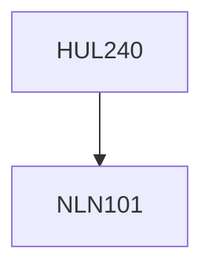

**Credits:** 4 (3-1-0)

**Prerequisites:** [[/NLN101|NLN101]]

#### Description
The aim of this course will be to read the poems of Indian English Writers (pre and post-Independence), with specific reference to the articulation of their identity. Some of the perspectives from which the poems will be discussed include the notion of home (childhood, family and ancestors); land (history, geography, community, caste and contemporary politics); language (the dialogue between the different languages in the creative repertoire of the poets); and culture (ritual, traditions, legends and myths). The course will also look at the differences between the resident and expatriate poets vis-a-vis the conflicts and resolutions as expressed in their poems.

### Prerequisite Tree

