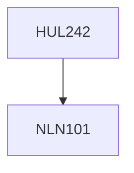

**Credits:** 4 (3-1-0)

**Prerequisites:** [[/NLN101|NLN101]]

#### Description
This course provides answers to basic questions about the nature and constitution of human language in the mind/brain of native speakers. Varied aspects of linguistic organization, including structures of sounds, words and sentences are considered to understand the core universals of all languages as well as their variations. Cases of feral children, language deficiencies and cognition-language interactions are also highlighted.

### Prerequisite Tree

