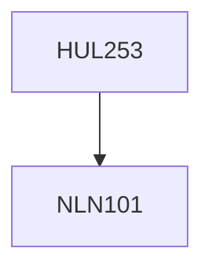

**Credits:** 4 (3-1-0)

**Prerequisites:** [[/NLN101|NLN101]]

#### Description
This is primarily a course in applied ethics. It will focus primarily on questions like: What is the meaning of right action? Can ethical assertions be true or false? Is morality relative to society? Or can we say that acts have universal moral content? The course discussions will help to demonstrate that morality is not always self-evident and that rational morality must come in place of taboo based moralities.

### Prerequisite Tree

