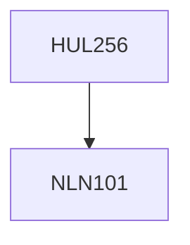

**Credits:** 4 (3-1-0)

**Prerequisites:** [[/NLN101|NLN101]]

#### Description
What makes philosophical thinking radically critical? Investigation of the nature of knowledge about the world and justification of knowledge claims. Metaphysical understanding of the Absolute and Mind-Body relation. The nature of ethical and aesthetic beliefs and attitudes as part of understanding the nature of values. The discussion of the above issues will be influenced by three philosophical orientational perspectives: Anglo-American Analytic, Continental Phenomenological and Classical Indian.

### Prerequisite Tree

