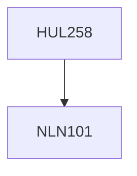

**Credits:** 4 (3-1-0)

**Prerequisites:** [[/NLN101|NLN101]]

#### Description
As closely aligned areas in philosophy– social philosophy with the role of individual in society and political philosophy with the role of government- this course bridges divides between social theory, political philosophy, and the history of social and political thought as also between empirical and normative analysis through perspectives from metaphysics, epistemology and axiology. A range of socio- political thinkers, theories and concepts will be taught. It will provide a broad survey of fundamental social and political questions in current contexts discussing philosophical issues central to political thought and radical critiques of current political theories.

### Prerequisite Tree

