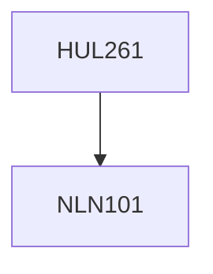

**Credits:** 4 (3-1-0)

**Prerequisites:** [[/NLN101|NLN101]]

#### Description
Psychological Science- Assumptions, schools, methods of doing psychology research, The relationship between brain, body and mental functioning, Sensation, perception and making sense of the world, Consciousness, Life span development and motor and language development, Nature and nurture controversy, The learning process and some important explanations of how we learn, Meaning of motivation and explanations, Theories of emotions and expression and regulation of emotions, Basic cognitive processes, Language development, why we remember and why we forget- some explanations, Different kinds of intelligence, explanations of creativity, Differences among individuals and explanations for personality differences, Application of psychology to everyday life- enhancing health and well-being, performance, social relations, and sensitivity to environmental, social and cultural contexts.

### Prerequisite Tree

