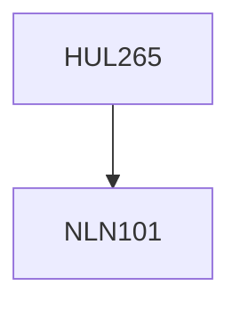

**Credits:** 4 (3-1-0)

**Prerequisites:** [[/NLN101|NLN101]]

#### Description
Personality: Meaning & Assessment. Psychoanalytic & Neo- Psychoanalytic Approach ; Behavioural Approach; Cognitive Approach; Social- Cognitive Approach; Humanistic Approach; The Traits Approach; Models of healthy personality: the notion of the mature person, the self-actualizing personality etc. Personality disorders; Psychotherapeutic techniques and Yoga & Meditation; Indian perspective on personality; Personality in Socio- cultural context.

### Prerequisite Tree

