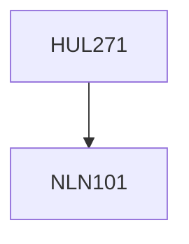

**Credits:** 4 (3-1-0)

**Prerequisites:** [[/NLN101|NLN101]]

#### Description
Introduction to the discipline of sociology and its emergence as a science in the context of the development of modern industrial society in Europe. Introduction to key classical and contemporary theorists in Sociology.

### Prerequisite Tree

