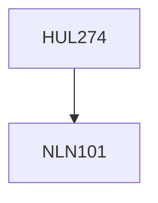

**Credits:** 4 (3-1-0)

**Prerequisites:** [[/NLN101|NLN101]]

#### Description
The examination of sources, the structure, the texts and exemplars of the Indian tradition provide the theoretical framework for the discussion of contemporary political and social issues. These are economic development and social justice religion and the nation, communalism and secularism, caste class and gender equity and so on. The political misuse of tradition in programs of reform and revival both in the past and in modern times will be highlighted to underline the need for rethinking tradition in an academically serious manner.

### Prerequisite Tree

