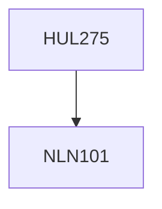

**Credits:** 4 (3-1-0)

**Prerequisites:** [[/NLN101|NLN101]]

#### Description
Students will be exposed to contemporary themes and debates on connection between environment, development, and society; industrialization and risk society; challenge of sustainable development; perception of the environment, dependence for livelihood, identity, and power on natural resources; social ecology; what is the role of religion in determining our world view and relation with the environment?; recognition of indigenous knowledge; rise of environmental movements, development projects and recent conflict over natural resources; understanding major environmental disasters and industrial accidents; global climate change negotiations; gender and environment.

### Prerequisite Tree

