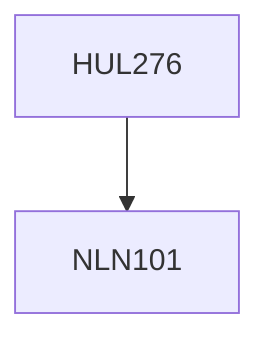

**Credits:** 4 (3-1-0)

**Prerequisites:** [[/NLN101|NLN101]]

#### Description
The de-mystification of science as a privileged form of knowledge since Copernicus. Re-examining the laboratory, the factory and the nation-state, structures linked to the West-European model of science. Examining systems deemed ethno-science or folk-lore, to set up a dialogue with institutionalized science. Comparing science with religion as forms of knowledge having competing power over human belief and action. Examining Traditional Knowledge (TK) systems and their relevance for global economy.

### Prerequisite Tree

