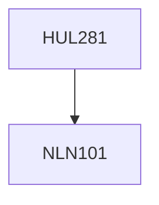

**Credits:** 4 (3-1-0)

**Prerequisites:** [[/NLN101|NLN101]]

#### Description
The course will begin with theories and concepts on the use of technologies to improve governance such as efficiency, transparency, empowerment, economic gains, decentralization etc. It will discuss the concepts of democracy and governance, corruption and accountability. Examples and case studies from topics such as information and communication technologies for development, electronic governance, electronic voting, electronic databases (UID), web portals, community radio etc. Public-private partnerships, regulation of technology by the state, surveillance, and the role of stakeholders in the policy making process.

### Prerequisite Tree

