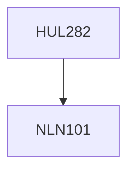

**Credits:** 4 (3-1-0)

**Prerequisites:** [[/NLN101|NLN101]]

#### Description
This course is an introduction to theories of communication for which there is not sufficient time in the other communication courses, which are mainly applied in their orientation. This is an interdisciplinary course. It will examine how the notion of communication is used in different disciplines in the humanities and the social sciences. It will intersect with problems of organizational structure, linguistic structure, interpersonal structure and the problem of what is involved in changing a structure. This course will include no components of remedial English, business correspondence or skill building activities. Only those really interested in theoretical questions should enroll.

### Prerequisite Tree

