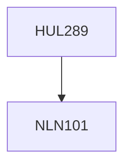

**Credits:** 4 (3-1-0)

**Prerequisites:** [[/NLN101|NLN101]]

#### Description
The course will begin by identifying various dimensions of human development and mapping the state of India and the world on these indicators. It will then discuss theories about how science and technology (S&T) have shaped human development historically and the dynamics of technological change. Relationship between innovation and human development will be discussed using examples from the appropriate technology movement, health, education, nutrition, energy, environment, and others. Gender dimensions of S&T, indigenous knowledge, and radical critiques of S&T will be discussed.

### Prerequisite Tree

