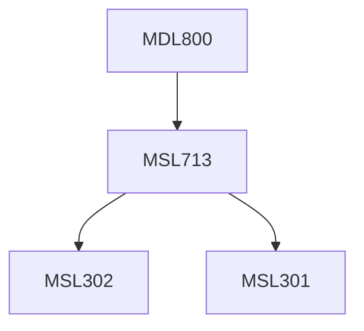

**Credits:** 1.5 (1.5-0-0)

**Prerequisites:** [[/Management Studies/MSL713|MSL713]]

#### Description
(about 100 words; Topics to appear as course contents in the courses of Study booklet) (Include Practical / Practice activities): Fundamental building blocks of blockchain. Concepts of initiating a blockchain project and management challenges surrounding complexity assessment, feasibility assessment, deployment, maintenance and technology upgradation. Understanding managerial implications of blockchain characteristics on adoption and diffusion in firms. Does the elements tie with Roger’s diffusion of innovation for emerging technologies? How do these characteristics require specific interventions in terms of organizational structures and relationships among participating organizations? Understanding governance and information management of blockchain characteristics, how can organization structure and networks play a role, understanding antecedents of diffusion of blockchain applications among firms and networks in industries, understanding enablers and barriers to use and usefulness of blockchain. Management case studies in corporate: banking; digital services; high-tech enterprises; supply chain. Management case studies in government and society, stakeholder specific impacts assessment.

### Prerequisite Tree

