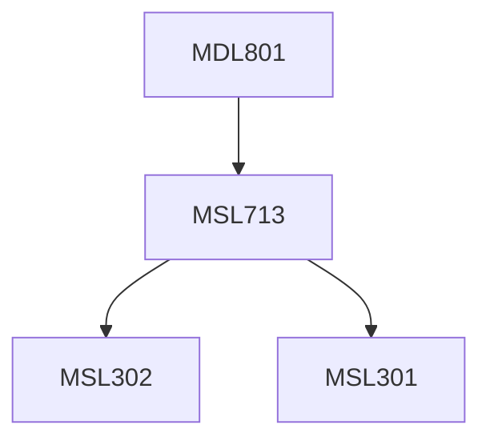

**Credits:** 1.5 (1.5-0-0)

**Prerequisites:** [[/Management Studies/MSL713|MSL713]]

#### Description
Making sense of ‘digital’ and ‘digital transformation’, digital competencies and contested boundaries in the information age, data as catalyst for digital transformation, achieving customer centricity through data integration, products vs. platforms and multi-sided markets, dynamics of renewal through digital transformation, organizational alignment for digital transformation, balancing g mainstream and new stream businesses coming from digital channel, technology leadership at large firms, open innovation & crowdsourcing, virtual reality, internet of things (IoT), AI, blockchain, big data.

Data Uses: legal and ethical considerations, such as data breaches, GDPR, and California data protection rules, Recent trends review and what the future holds.

### Prerequisite Tree

