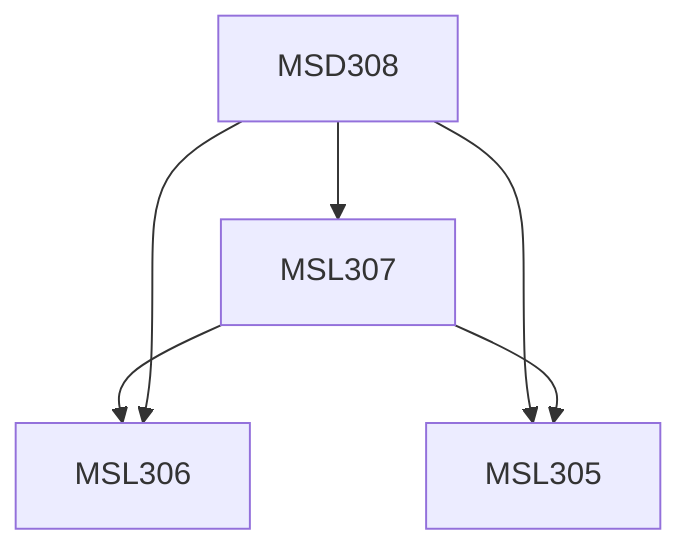

**Credits:** 1.5 (0-0-3)

**Prerequisites:** [[/Management Studies/MSL305|MSL305]], [[/Management Studies/MSL306|MSL306]], [[/Management Studies/MSL307|MSL307]]

#### Description
Business Model concept, Emerging Business Models, Lean Business Modelling, Business Model Innovation & Design, Value Proposition, Market Analysis, Market Sensing, Understanding consumer perception and behaviour, Knowing market dynamics, Competitive Advantage, Willingness to Pay.

Qualitative & Secondary Market Research methods for startups, Target segment identification, Demand analysis and forecasting, Market Strategy and Marketing Plan, Go-To-Market process, Building Marketing & Sales teams, Business Development, Brand building and Brand Communication, Minimum Viable Product (MVP).

### Prerequisite Tree

