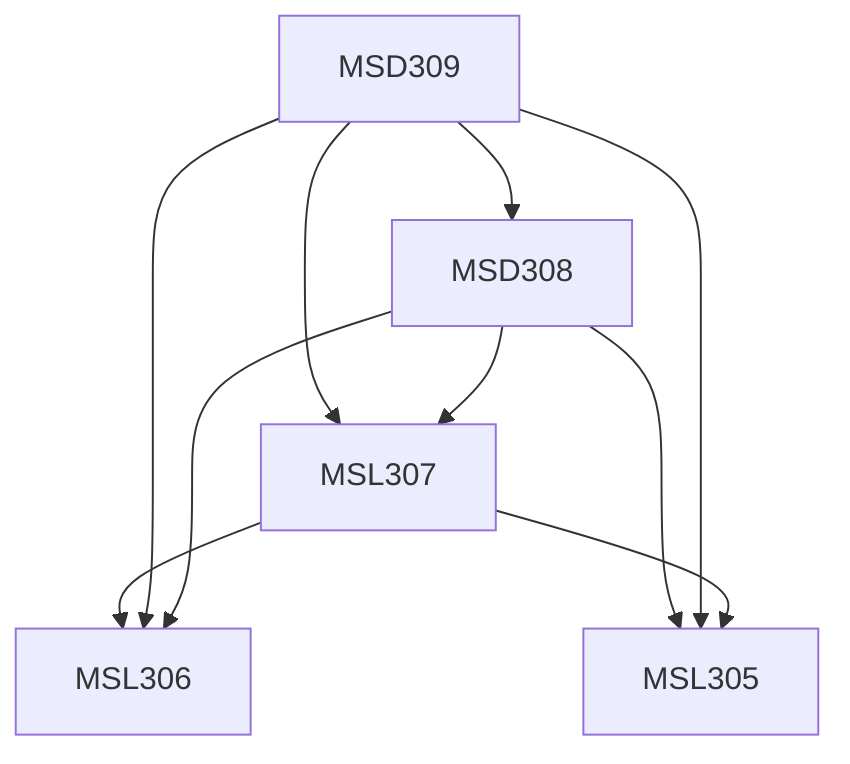

**Credits:** 1.5 (0-0-3)

**Prerequisites:** [[/Management Studies/MSL305|MSL305]], [[/Management Studies/MSL306|MSL306]], [[/Management Studies/MSL307|MSL307]], [[/Management Studies/MSD308|MSD308]]

#### Description
Business Planning & Assumptions, Growth Projection, Realistic Cost estimation, Revisiting/Critiquing 'State of the Venture’, Cost monitoring and Management techniques, Products/services pricing techniques, Revenue projections, Financial Analysis and ratios, Effective communication for funding, Business Presentation Components Venture Pitching, Organising venture Information for presentation Fund Sourcing Strategy, Fund Usage, Optimal usage of investment funds, Planning & Preparing for Scaling Venture Scaling. Fund Usage, Scaling issues, Budget preparation, Detailed planning for business operations, Business monitoring and performance metrics.

### Prerequisite Tree

