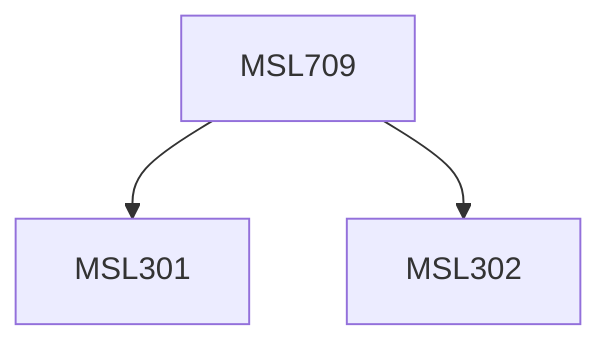

**Credits:** 1.5 (1.5-0-0)

**Prerequisites:** [[/Management Studies/MSL301|MSL301]] & [[/Management Studies/MSL302|MSL302]]

#### Description
Introduction to Business Research Methods; Theoretical approaches; Problem definition; Research Design; Questionnaires & Scales; Sampling - Probability, size and challenges; Survey & Observation, Experiments; Qualitative Research, Secondary Data; Data Preparation & Analysis, Report Writing.

### Prerequisite Tree

