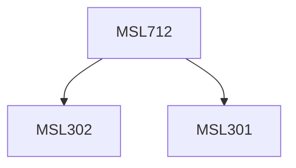

**Credits:** 1.5 (1.5-0-0)

**Prerequisites:** [[/Management Studies/MSL301|MSL301]] & [[/Management Studies/MSL302|MSL302]]

#### Description
Ethics & Business, Ethical principles in business, Business and Its External Exchanges: Ecology & Consumers, Business & Its Internal Constituencies.

### Prerequisite Tree

