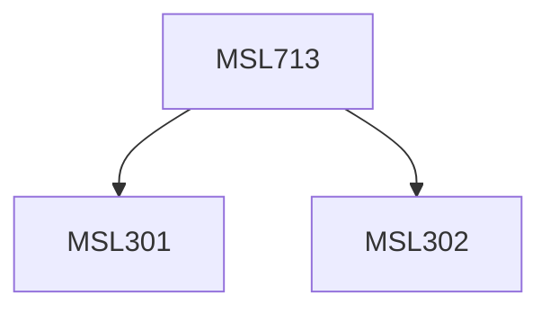

**Credits:** 3 (3-0-0)

**Prerequisites:** [[/Management Studies/MSL301|MSL301]] & [[/Management Studies/MSL302|MSL302]]

#### Description
This course may expose the participants to the following topics: Information Systems and its impact in Organization and People, Information Technologies: concepts, types and usage, Information Systems, Organizations and Strategy, Economics of Information Systems, Foundations of E-Business, Foundations of Data management, Foundations of Business Analytics, Networks and Collaboration as Business Solutions, Information Security & Risk Management, Building and Managing Systems, Enterprise Systems, etc. Hands on training would also be provided, using specific tools.

### Prerequisite Tree

