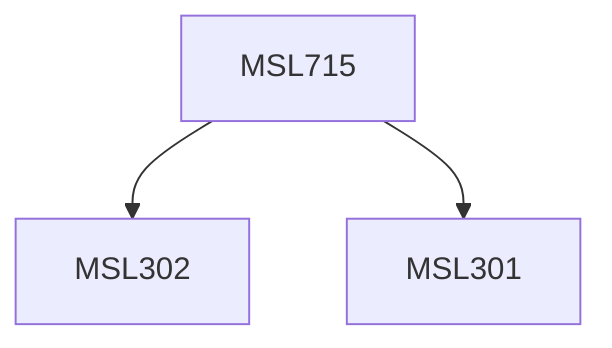

**Credits:** 3 (3-0-0)

**Prerequisites:** [[/Management Studies/MSL301|MSL301]] & [[/Management Studies/MSL302|MSL302]]

#### Description
Module I : Concept of Total Quality, Quality Management Systems as a means of achieving total quality. Linkage of Quality and Environment Management System. Strategic concern for Environment. Need and relevance of documentation and standardization of Management Systems. Various tools of documenting and recording the Management Systems, Various standards for Management Systems. Flexibility and change in Management Systems and documented procedures.

Module II : Quality Management Systems, IS0 9000, Quality Policy, Data, Records and Traceability. Documenting the Quality System: Quality Manual, Quality Audit, Design and Change Control, ISO 9000 Registration. Six Sigma. Awards and appreciation, DMAIC approach.

Module III : Need for proper Environment Management Systems and their economic implications. Environment Management Systems, Green Products and Strategies, Environment Assessment: Environment Protection Act, ISO 14000, Case Studies.

### Prerequisite Tree

